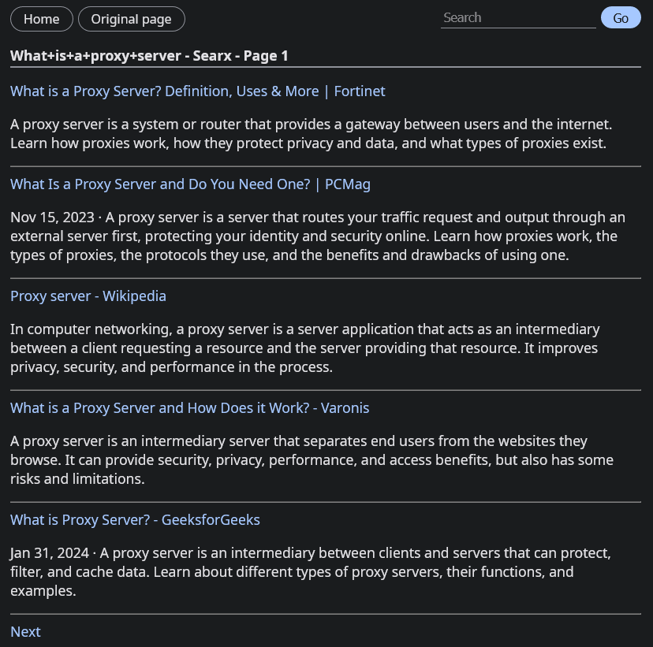

<h1 align="center">
  <a href="https://github.com/TxtDot/txtdot"></a>
  <br>
  <a href="https://txtdot.github.io/documentation"></a>
  <a href="https://github.com/TxtDot/instances"></a>
  <br>
  <a href="https://github.com/TxtDot/txtdot/blob/main/LICENSE"></a>
  <a href="https://github.com/TxtDot/txtdot/releases/latest"></a>
  <a href="https://matrix.to/#/#txtdot:matrix.org"></a>
</h1>

HTTP proxy that parses only text, links and pictures from pages
reducing internet traffic, removing ads and heavy scripts.
Mozilla's Readability library is used under the hood.

## Features

- Server-side page simplification
- Media proxy
- Image compression with Sharp
- Search with SearXNG
- Custom parsers for StackOverflow and SearXNG
- Handy API endpoints
- No client JavaScript
- Some kind of Material Design 3

## Running

### Development

```bash
npm install
npm run dev
```

### Production

```bash
npm install
npm run build
npm run start
```

### Docker

```bash
docker compose up -d
```

## Screenshots




## Performance tests
// TODO

## Credits

- [Readability.js](https://github.com/mozilla/readability)
- [🔗 LinkeDOM](https://github.com/WebReflection/linkedom)
- [Fastify web framework](https://github.com/fastify/fastify)
- [EJS](https://github.com/mde/ejs)
- [Axios](https://github.com/axios/axios)
- [DOMPurify](https://github.com/cure53/DOMPurify)
- [Sharp](https://github.com/lovell/sharp)
- [MicroMatch](https://github.com/micromatch/micromatch)
- [RouteParser](https://github.com/rcs/route-parser)
- [IconvLite](https://github.com/ashtuchkin/iconv-lite)
